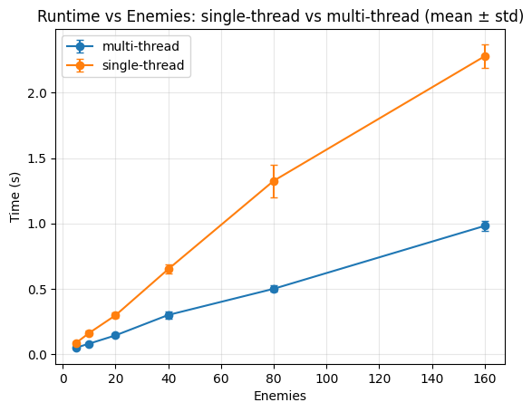

# Многопоточная версия

В проекте есть отдельная многопоточная реализация с суффиксом `_mt`. Она не собирается по умолчанию: основной путь проекта остается однопоточным, а `_mt` включается явно через CMake-опцию

```bash
-DTERMINAL_TACTICS_BUILD_MT=ON
```

Причина такого разделения не в том, что многопоточная версия не удалась. Сейчас она имеет отдельную CTest-цель и проверяется в CI вместе с основной версией. В истории проекта она также проверялась через ThreadSanitizer без обнаруженных race condition и показывала прирост производительности более чем в 2 раза на benchmark-сценарии с большим количеством врагов

Однопоточная версия собирается по умолчанию, потому что не требует oneTBB и быстрее компилируется. Многопоточная версия является поддерживаемой альтернативной сборкой с параллельной обработкой хода ИИ и синхронизацией состояния игры

## Что параллелится

Многопоточность применяется точечно к обработке хода ИИ. В пошаговой игре пользовательский ход обычно не требует распараллеливания, но ход большого количества врагов естественно делится на независимые действия

Идея такая:

- основная игровая модель остается той же
- правила игры не меняются
- параллелится обработка AI turn
- после завершения worker-потоков игра продолжает обычный цикл

## Что используется

- `std::jthread` для worker-потоков при обработке AI turn
- `std::mutex`, `std::shared_mutex`, `std::lock_guard` и `std::unique_lock` для защиты изменяемого состояния
- TBB-контейнеры, например `tbb::concurrent_hash_map`, для разделяемых структур
- `tbb::parallel_for` и `tbb::parallel_invoke` для независимых подзадач
- `EntityLockPool` для lock-ов по `EntityId`
- отдельный namespace `game::mt`, чтобы не смешивать обычную и многопоточную модели

## EntityLockPool

Компоненты защищают свое внутреннее состояние, но сервисная операция часто затрагивает сразу несколько частей игры. Например атака работает с атакующим и целью, а использование предмета может менять пользователя, цель и инвентарь

`EntityLockPool` дает lock на уровне сущности:

- `lock_entity(id)` блокирует одну сущность
- `lock_entities(a, b)` блокирует две сущности
- две сущности блокируются в порядке `min(id), max(id)`

Упорядоченный захват lock-ов нужен, чтобы избежать deadlock-а вида:

- поток 1 держит lock сущности A и ждет lock сущности B
- поток 2 держит lock сущности B и ждет lock сущности A

Если все операции с двумя сущностями используют один и тот же порядок lock-ов, такой deadlock не возникает

## ThreadSanitizer

Многопоточная версия проверялась через ThreadSanitizer. Для локальной проверки можно собрать проект примерно так:

```bash
cmake -S . -B build-tsan -DCMAKE_BUILD_TYPE=Debug \
  -DTERMINAL_TACTICS_BUILD_MT=ON \
  -DTERMINAL_TACTICS_BUILD_APP=OFF \
  -DCMAKE_CXX_FLAGS="-fsanitize=thread -g -O1" \
  -DCMAKE_EXE_LINKER_FLAGS="-fsanitize=thread"

cmake --build build-tsan --parallel
ctest --test-dir build-tsan --output-on-failure
```

Та же конфигурация описана CMake preset-ом:

```bash
cmake --preset thread-sanitizer
cmake --build --preset thread-sanitizer
ctest --preset thread-sanitizer
```

ThreadSanitizer хорошо ловит data race, но не доказывает полную корректность многопоточной программы. Он не заменяет stress-тесты, проверку deadlock-ов и проверку игровых инвариантов

## Автоматические тесты

При `TERMINAL_TACTICS_BUILD_MT=ON` собирается `tests/test_mt.cpp`. Тесты проверяют:

- конкурентное чтение сущности из `Level`
- сериализацию одновременных обновлений `TimePointsComponent`
- единый порядок захвата двух блокировок в `EntityLockPool`
- параллельное восстановление очков времени всей команды
- разрушение клетки без повторного захвата `field_mutex_`

Полный набор обычных и MT-тестов можно запустить в чистом контейнере:

```bash
make docker-test
```

Локальный эквивалент - `make mt-test`, а проверка с ThreadSanitizer запускается через `make tsan-test`

## Benchmark

В `docs/assets/multithreading-test.png` сохранен график старого сравнения однопоточной и многопоточной версий



Исходные данные, окружение и точные условия запуска не сохранились, поэтому график не является полностью воспроизводимым отчетом. Его корректнее читать как результат прошлого тестирования: на большом числе врагов многопоточная обработка AI turn давала ускорение более чем в 2 раза

Текущий статус многопоточной версии: поддерживаемая opt-in сборка в `main` с отдельными тестами и CI-проверкой. Она демонстрирует работу с потоками, синхронизацией, TBB и ThreadSanitizer
